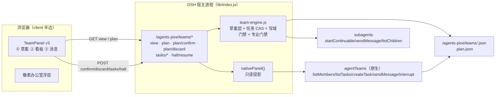
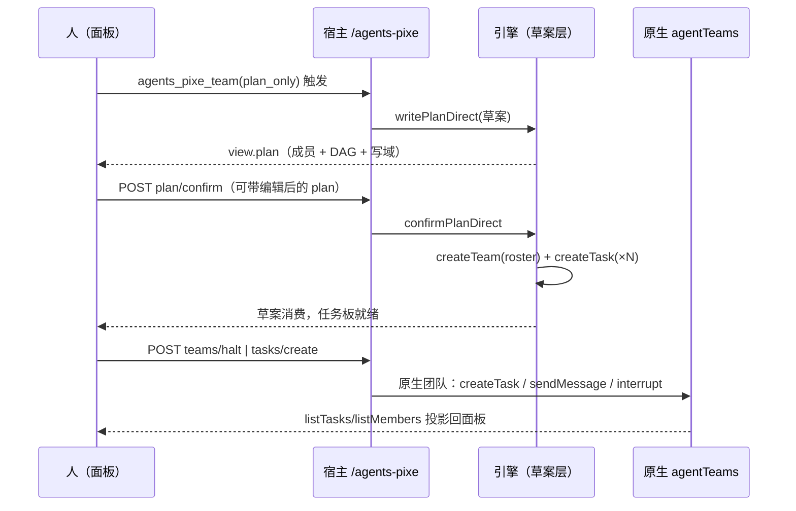

# 团队面板 v3 · 设计与落地方案（三件套）

> 样板：[`sample-5-teamops.html`](./sample-5-teamops.html)（可点：① 草案确认 ② 执行·写向 ③ 消息流）
> 结论先行：**现在的面板只够"看"，不够"干"**。差三处：原生团队写不进去、计划闸门没有 UI、消息与回执看不见。

## 1. 现状判定（为什么"不合适交互工作"）

| 场景 | 现状 | 判定 |
|---|---|---|
| 看进度 | 成员色点 + 任务卡 + 3s 轮询全量刷新 | 🟡 够看，但无增量、无滚动保持 |
| 派活 / 改任务 | 0.2.9 起原生投影模式**隐藏全部写按钮** | ❌ 只能靠对 agent 说一句话 |
| 过目分工再烧 token | 0.2.10 后端有草案，**面板不渲染** | ❌ 闸门在 API 层，人点不到 |
| 成员之间说了什么 | `messages` 落盘，面板不展示 | ❌ 协作过程不可见 |
| 桌面/窄栏 | 浮层可拖拽 + 缩放 0.5–2.5 | ✅ |

## 2. 三件套（本次定版）

1. **写向**：面板对**原生团队**直接派单 / 建任务 / 暂停（走 `agentTeams.createTask/sendMessage/interrupt`），只读投影降级为一种显式模式。
2. **草案确认**：渲染 0.2.10 的草案（成员占位 + 分工 + 依赖 + 写域），支持**改后确认**、丢弃；确认才建会话。
3. **消息流**：成员↔成员/领袖消息 + 回执状态（已入队 / 已送达），只读时间线。

## 3. 开发架构（拓扑）

分层铁律：**机制用宿主（原生 or 本插件引擎），人格/权限/判据用角色卡，面板只做投影与写入口**。

## 4. 生产流程（一次团队任务）

## 5. 组件清单（改造点）

| 组件 | 现有 | v3 增改 |
|---|---|---|
| `TeamActivityPanel` | 任务 CRUD + halt + 3s 轮询 | 三页签（草案/看板/消息）；原生**可写**模式；增量刷新与滚动保持 |
| 新增 `PlanReview` | — | 渲染 `view.plan`；改分工/依赖写回；确认/丢弃 |
| 新增 `MessageStream` | — | `messages`（引擎）/ 原生 mailbox 时间线 + 回执徽章 |
| 写向动作 | 只打本插件引擎端点 | 原生模式改打原生工具（经宿主代理端点） |
| 来源徽章 | 0.2.9 只读徽章 | 三态：本插件引擎 / 原生可写 / 原生只读 |

## 6. 数据契约（已存在，面板直接用）

- `GET /agents-pixe/teams/view?lead=` → `{ members , tasks , halted , lastStep , source:'native'|'engine' , readOnly? , plan }`
- `GET /agents-pixe/teams/plan?lead=` → `{ ok, plan }`
- `POST /agents-pixe/teams/plan/confirm { lead, plan? }` → `{ ok, confirmed, members, tasks }`
- `POST /agents-pixe/teams/plan/discard { lead }` → `{ ok, discarded }`
- 写向（原生模式，v3 新增代理端点）：`POST /agents-pixe/teams/native/tasks/create|update|interrupt`

## 7. 设计 token（不硬编码色值）

| 语义 | token |
|---|---|
| 面板底 / 卡片 | `--px-paper` / `--px-paper-2` |
| 描边 / 阴影 | `--px-ink` / `--px-shadow-soft` |
| 运行 / 完成 / 阻塞 / 失败 | `--px-green` / `--px-blue` / `--px-amber` / `--px-red` |
| 主强调 / 次强调 | `--px-violet`（选中、焦点） / `--px-cyan`（成员互发消息） |
| 文本层级 | `--dsw-alias-label-primary` / `--dsw-alias-label-secondary` |
| 焦点可达 | `.px-node:focus-visible` / `.px-switcher button:focus-visible` |

## 8. 验收断言（可执行）

1. `node --test` 全绿（现 157/157，新增面板契约测试后 ≥165）。
2. `POST /teams/plan/confirm` 后 `view.members.length` = 草案成员数，`view.plan` = null（草案被消费）。
3. 原生可写模式下 `POST /teams/native/tasks/create` 落到 `agentTeams.createTask`（用假服务断言调用次数），且面板不再出现"只读"徽章。
4. `messages` 时间线渲染条数 = 引擎 `messages` 尾部 50 条；无消息时显示空态文案而非空白。
5. 3s 轮询改为 ≥3s 的差异刷新：连续两次 `view` 内容不变时**不重建 DOM**（用渲染计数断言）。

## 9. 风险

- **双真相源回潮**：写向必须打原生接口，禁止再把原生任务复制进本插件文件。
- **轮询风暴**：面板常驻 + 3s 轮询 = 每小时 1200 次请求；改增量（`lastStep`/`revision` 比对）后回落。
- **写权限**：面板写向端点必须保留 `localOnly` 守（跨源拒绝），原生调用以会话 Agent 为凭据。
