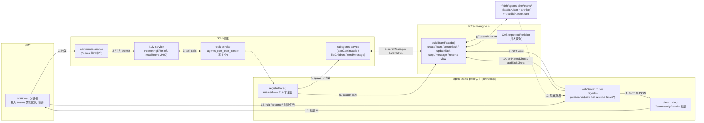

# agent-teams-pixel 团队引擎设计分析

> 这份文档给阅读代码或选型时想知道「为什么要这样做」的读者——
> 重点不是 API 列表（见 [usage.md](./usage.md)），而是规格背后的取舍。

## 1. 为什么需要「真·团队引擎」

DSH 早期的角色工具是单回合的：领袖问「你看法」，每个成员同上下文串行答一次。
这对「谁懂什么」型的查询够用，但缺三样真团队协作必需的能力：

1. **续聊上下文**——成员是个有记忆的同事，不是一次性问答机。
2. **依赖任务图**——「先调研，再设计，再实现」必须是显式 DAG，不能靠领袖口述。
3. **并发派单**——领袖不该自己排队调成员，应该把任务丢进调度器，引擎自己唤醒空闲成员。

`agents-pixe` 把这三件事做成 `lib/team-engine.js`，宿主 (`lib/index.js`)
只负责把引擎的 6 个工具 + 视图路由接到 DSH 编排层（`agents_pixe_team_create` 等）
和办公室浮层（`/agents-pixe/teams/view`）。

## 2. 全栈拓扑

从用户在 DSH 对话框打 `/teams` 到像素办公室抽屉里看到泳道 DAG，端到端数据流：



**数据流要点：**

1. `/teams` 命令通过 `commands.register` 入宿主，DSH 调度到 LLM
2. 模型在 `agents_pixe_team_create` / `task_create` / `team_step` / `task_update` / `team_report` 五个工具之间循环调用
3. 工具最终走 `buildTeamFacade`，由 facade 直接管文件态
4. 客户端**不调用**任何宿主工具，**只读** `/agents-pixe/teams/view` 的 GET 端点（POST 仅本地 CSRF 守）
5. 子代理（spawnTeammate 起的成员）经 `subagents.sendMessage` 唤醒；成果直投 `<leadId>.inbox.json`
6. 端到端**真相快照 = 磁盘 JSON**——前端轮询读到什么就是什么，不依赖子代理主动回调

## 3. 核心数据模型（落盘形态）

引擎把团队状态落到 `~/.dsh/agents-pixe/teams/<leadId>.json`（单文件、原子 rename）：

```jsonc
{
  "leadId":   "session-abc",
  "at":       1730000000000,
  "members":  [{ "id": "child-1", "name": "高级软件架构师", "desc": "...", "status": "running", "provider": "spawn" }],
  "tasks":    [{ "id": "T1", "subject": "需求分析", "blockedBy": [], "status": "pending", "revision": 0,
                 "attempts": [] }]
}
```

设计要点：

- **一领袖一活动团队**（`createTeam` 幂等）：避免「这个任务归哪边」歧义。
- **任务 `revision` + CAS**：`updateTask` 必须带 `expectedRevision`，版本不匹配直接拒绝。
  这是多人 / 多会话同时改同一份文件时不互踩的关键。
- **attempt 数组**：每次 claim/complete/reopen 都落 attempt 记录，便于冷停后恢复对账。

## 4. 任务状态机

```
pending ──claim──> in_progress ──complete──> completed
   ↑                    │                        │
   │     release        │       reopen           │ set_dependencies
   └────────────────────┘                        │ edit
                                                 │ reassign
                                                 ▼
                                              (same status)
                              in_progress ──delete──> deleted
```

非法跳跃在 `transitionAllowed` 里硬卡死，UI 上看不到的状态转换直接抛 `BAD_TRANSITION`。
这是规范里最值得回归测试的一块——状态机一旦写歪，调度器会进死锁。

## 5. 调度器：`agents_pixe_team_step`

调度器每次调用做三件事，顺序硬编码：

1. **冷恢复**：扫描所有 `in_progress` 任务，若属主当前不是 `running`（冷进程重启），
   自动 release 并把它重新放回 ready。
2. **原子领取**：对每个空闲成员跑一次 `CAS claim`——拿第一个 ready 任务，
   失败就跳过（被别的成员抢走）。这是无锁并发的核心。
3. **有界等待**：`waitMs` 内轮询成员的 inbox/reply，避免轮询死循环。

`waitMs` 默认 2000ms，上限 60000ms。建议团队规模每成员留 5–10s 缓冲。

## 6. 成员 ↔ 领袖通信

- 成员发 `@lead` → 进 inbox，领袖下次 `team_step` 或 `team_report` 看到。
- 领袖发成员名 → 该成员的 `sendMessage` 被唤醒，成员继续工作。
- 成员 ↔ 成员不邻接（避免两人绕开领袖私自协作）——必须由领袖转达。

## 7. i18n 中英切名

`TEAM_PRESETS` 每条有 `name`（中文）/ `nameEn`（英文）。
`findPreset(raw)` 同时匹配两者（精确 + 大小写无关子串兜底）。
`presetDisplayName(p)` 在 `memberLang() === 'en'` 时返回 `nameEn`，否则 `name`。
`memberOf(m)` 同理——`en` 时取 `m.name`，`zh` 时取 `m.cname || m.name`。

DSH locale 通过 `agents-pixe.lang.v1` 这条 persist key 镜像到磁盘，
宿主侧 `memberLang()` 读它决定输出语言。客户端负责把 `LOCALE_SVC.active` 写进去。

## 8. 安全与回退

- 引擎 facade 内部每个磁盘写都 `renameSync` 原子替换（不会半截损坏文件）。
- 调度器最多并行的成员数由 `max_roles` 限制（默认 4，最大 8）——避免 token 失控。
- `report` 只在 `open === 0` 时调 LLM 合成正式报告；草稿归档走纯文件，不烧 token。
- 引擎任何失败（冷启动缺 `subagents` / 磁盘满 / CAS 冲突）都 `console.warn` 暴露根因，
  不静默吞——因为团队任务的失败比单人失败难排查得多。

## 9. 宿主接线（lib/index.js）

```
apply()
  ├─ buildTeamFacade({ subagents, llm, teamsDir, callLlm }) → teamEngine
  │
  ├─ registerFace()              ← settings.scope.watch 重入会再调一次
  │   ├─ disposePrompt / disposeTool / disposeTeamTool / disposeEngine / disposeCmd
  │   ├─ enabled === true 才注册：
  │   │   ├─ systemPrompt.section('tool:agents-pixe')
  │   │   ├─ agents_pixe_roles       (取角色卡)
  │   │   ├─ agents_pixe_team        (runEngineTeam 一站式)
  │   │   ├─ 6 个引擎工具 (teamEngine.createTeam/createTask/updateTask/step/message/report)
  │   │   └─ commands.register({ name: 'agent-teams' })
  │   └─ 注册一轮 = 9 项 (roles + team + 6 引擎 + cmd)
  │
  └─ /agents-pixe/teams/view?lead=<sid>   ← 客户端面板读磁盘真相快照（3s 轮询）
```

scope.watch 重入不重复注册：所有 dispose 都先调用旧 token，再注册新的。
这保证用户改一次开关不会让工具列表里出现两份同名工具（dsh 会告警）。

## 10. 相关文件

- 引擎实现：`lib/team-engine.js`（375 行，纯逻辑可单测）
- 宿主接线：`lib/index.js`
- 浮层面板入口：`src/client.main.js`（`TeamActivityPanel` 组件 + `shell.overlay` slot）
- 用户文档：[usage.md](./usage.md)
